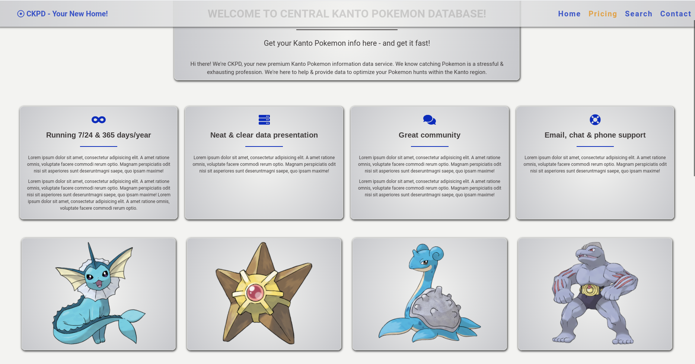
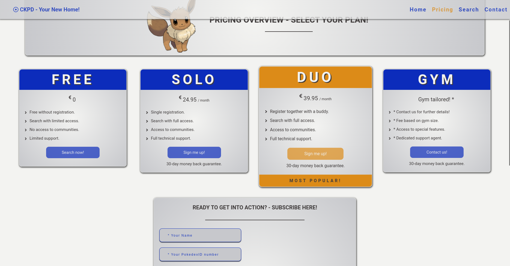
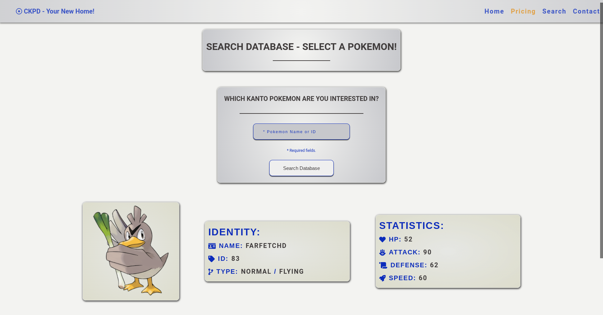
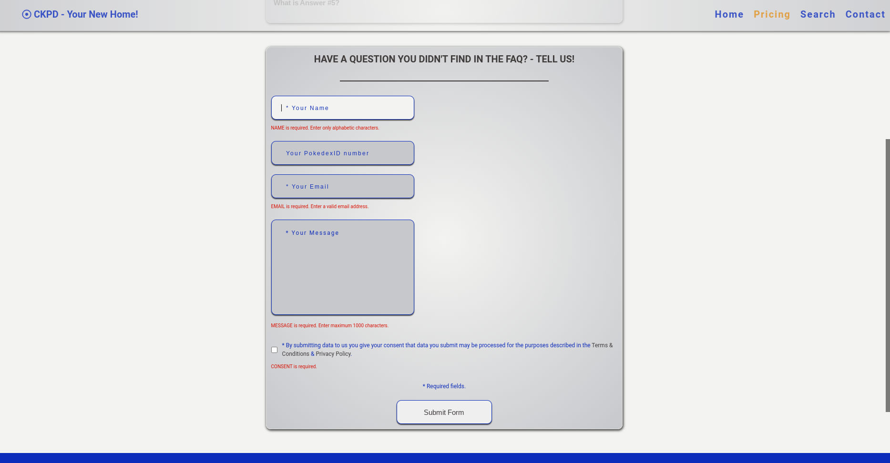

### central_kanto_pokemon_database || project-003 || tmsnvk
#### description
+ a Mongo/Express/React/Node application that imitates a subscription-based service site with two form submit pages and an API search functionality.
+ the API is served from [pokeapi.co](https://pokeapi.co/).
+ to run the application:
  +  the github version is fully functional as the used API doesn't require registration.
  +  only the MongoDB connection requires entering a valid database cluster address in the .env_sample file; once that's done, rename the file to .env.
  +  OR visit the live heroku deployed version [here](https://BLANK.herokuapp.com/).

#### project structure
```
*
|- .env_sample
|- .gitignore
|- license.md
|- package.json
|- package-lock.json
|- readme.md
|- screenshot_one.png
|- screenshot_two.png
|- screenshot_three.png
|- screenshot_four.png
|- screenshot_five.png
|- server.js
|- CLIENT
  |- .gitignore
  |- jsconfig.json
  |- package.json
  |- package-lock.json
  |- PUBLIC
    |- favicon.ico
    |- index.html
  |- SRC
    |- index.js
    |- COMPONENTS
      |- COMMONCOMPONENTS
        |- ELEMENTCONTAINER
          |- ElementContainer.js
          |- index.js
        |- FORMCONTAINER
          |- FormContainer.js
          |- index.js
        |- FORMLINK
          |- FormLink.js
          |- index.js
        |- FORMSUBMITBUTTON
          |- FormSubmitButton.js
          |- index.js
        |- HEADERMAINTITLE
          |- HeaderMainTitle.js
          |- index.js
        |- HEADERMESSAGE
          |- HeaderMessage.js
          |- index.js
        |- HEADERSUBTITLE
          |- HeaderSubTitle.js
          |- index.js
        |- IMAGE
          |- Image.js
          |- index.js
        |- INFORMATIONHASHLINK
          |- index.js
          |- InformationHashLink.js
        |- INFORMATIONLINK
          |- index.js
          |- InformationLink.js
        |- INFORMATIONTEXT
          |- index.js
          |- InformationText.js
        |- INPUTERRORMESSAGE
          |- index.js
          |- InputErrorMessage.js
        |- INPUTFIELD
          |- index.js
          |- InputField.js
        |- INPUTFORMLABEL
          |- index.js
          |- InputFormLabel.js
        |- ITEMCONTAINER
          |- index.js
          |- ItemContainer.js
        |- ITEMRADIOBUTTON
          |- index.js
          |- ItemRadioButton.js
        |- ITEMRADIOCONTAINER
          |- index.js
          |- ItemRadioContainer.js
        |- MAINRADIOCONTAINER
          |- index.js
          |- MainRadioContainer.js
        |- RADIOFORMLABEL
          |- index.js
          |- RadioFormLabel.js
        |- REQUIREDFIELDS
          |- index.js
          |- RequiredFields.js
        |- STYLEDICON
          |- index.js
          |- StyledIcon.js
      |- LAYOUTCOMPONENTS
        |- CONTACT
          |- CONTACTFORM
            |- ContactForm.js
            |- index.js
          |- FAQCONTAINER
            |- componentData.js
            |- FaqContainer.js
            |- FaqItem.js
            |- index.js
          |- HEADER
            |- Header.js
            |- index.js
        |- ERROR
          |- ERRORCONTAINER
            |- ErrorContainer.js
            |- index.js
        |- HOME
          |- HEADER
            |- Header.js
            |- index.js
          |- HOWIMAGE
            |- HowImage.js
            |- index.js
          |- HOWTEXT
            |- componentData.js
            |- HowText.js
            |- index.js
          |- OPTIONS
            |- index.js
            |- Options.js
          |- POKEMONCARDS
            |- componentData
            |- index.js
            |- PokemonCards.js
          |- STATISTICS
            |- componentData
            |- index.js
            |- Statistics.js
          |- SUMMARYCARDS
            |- componentData.js
            |- index.js
            |- SummaryCards.js
        |- PRICING
          |- HEADER
            |- Header.js
            |- index.js
          |- SIGNUPFORM
            |- index.js
            |- SignupForm.js
          |- SUBSCRIPTIONOPTIONS
            |- componentData.js
            |- index.js
            |- SubscriptionOptions.js
        |- SEARCH
          |- HEADER
            |- Header.js
            |- index.js
          |- RESULT
            |- index.js
            |- Result.js
          |- SEARCH
            |- index.js
            |- Search.js
        |- SUCCESS
          |- SUCCESSCONTAINER
            |- index.js
            |- SuccessContainer.js
      |- MAINCOMPONENTS
        |- App.js
        |- Footer.js
        |- Navbar.js
    |- LAYOUTS
      |- ContactLayout.js
      |- ErrorLayout.js
      |- HomeLayout.js
      |- PricingLayout.js
      |- SearchLayout.js
      |- SuccessLayout.js
    |- UTILITIES
      |- ICONLIST
        |- iconList.js
        |- index.js
      |- SCROLLTOTOP
        |- index.js
        |- ScrollToTop.js
|- MODELS
  |- ContactForm.js
  |- SignupForm.js
|- ROUTES
```

#### used packages
```
BACKEND
+ axios                    - making api calls.
+ body-parser              - body parsing middleware.
+ cors                     - cors enabling middleware.
+ dotenv                   - loading an .env variable to store not-public configuration data.
+ express                  - server framework.
+ helmet                   - securing express.
+ mongoose                 - schema-based solution to model data. 

FRONTEND
+ axios                    - making api calls.
+ fontawesome              - using various icons as styling.
+ react                    - front-end framework.
+ react-ga                 - google analytics package.
+ react-hook-form          - handling forms & submission validation.
+ react-router-dom         - routing.
+ react-router-hash-link   - hash-based routing.
+ styled-components        - css-in-js styling.
```

#### screenshot
<!--  -->
<!--  -->
<!--  -->
<!--  -->
<!--  -->