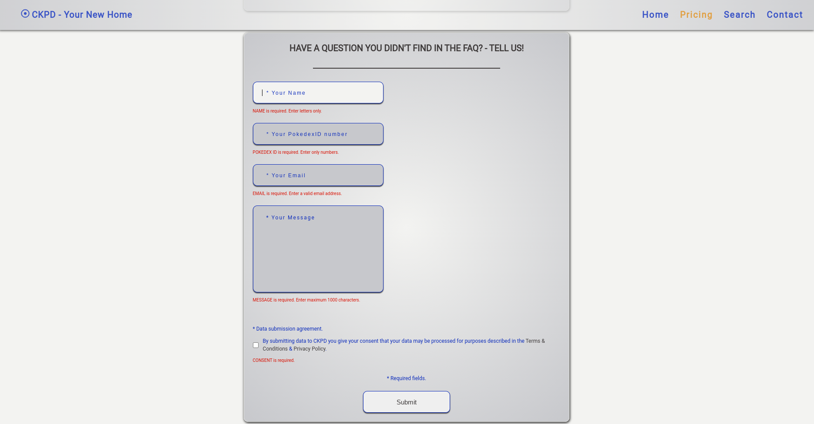

### central_kanto_pokemon_database || project-003
#### description
+ a React front-end and Node.JS/Express back-end application using MongoDB to store site-specific data. The application imitates a subscription-based service site with two form submit pages and a search functionality serving a public API database.
+ the third-party API is served from [pokeapi.co](https://pokeapi.co/).
+ to run the application:
  +  check .env_sample to see what is needed for the application to be fully functional. 
  +  rename the file to .env, install the project dependencies and start the application.
  +  OR visit the live heroku deployed version [here](https://ckpd.herokuapp.com/). The application is currently running on a free tier option, so it might need a minute or two to boot up.

#### used packages
```
FRONTEND
+ axios                    - http client.
+ fontawesome              - icons for styling purposes.
+ react                    - client-side framework.
+ react-ga                 - google analytics package.
+ react-helmet             - document head element handler.
+ react-hook-form          - form handling & client-side form validation.
+ react-router-dom         - routing.
+ react-router-hash-link   - hash-based routing.
+ styled-components        - css-in-js styling.

BACKEND
+ axios                    - http client.
+ compression              - compression middleware.
+ cors                     - cors enabling middleware.
+ dotenv                   - .env variable loader to store not-public configuration data.
+ express                  - server-side framework.
+ helmet                   - express securing middleware.
+ mongoose                 - schema-based solution to model data.
+ nodemailer               - email sending module.
```

#### screenshots


