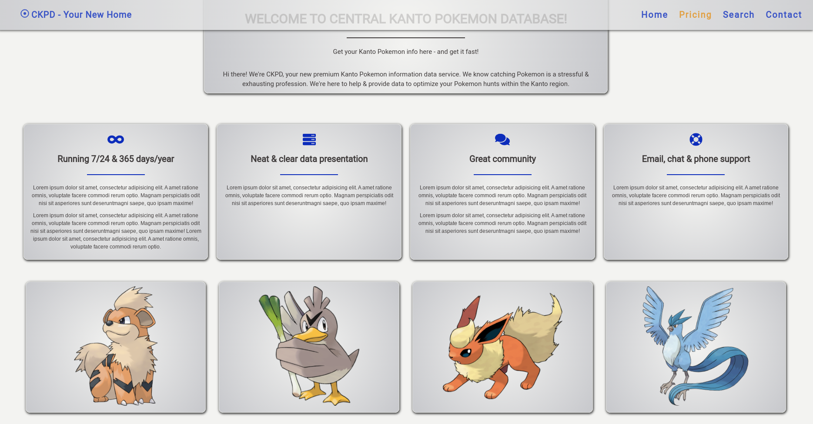
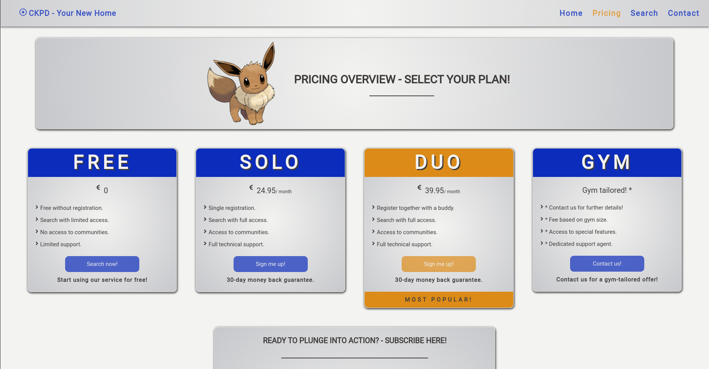
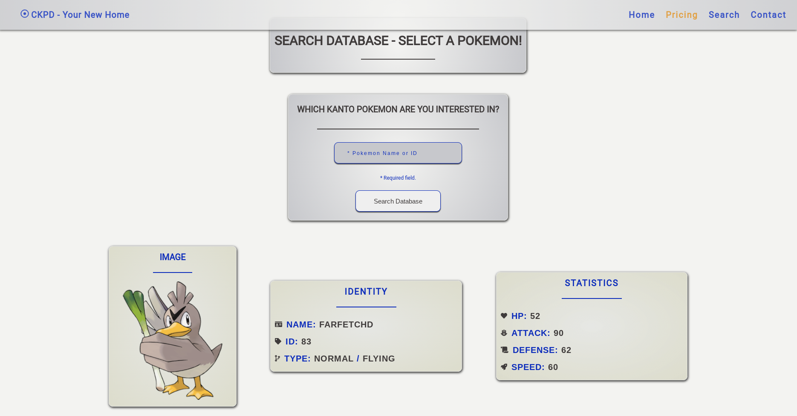

### central_kanto_pokemon_database || project-003
#### description
+ a ReactJS front-end and NodeJS/NestJS back-end application using MongoDB to store site/user-specific data. The application imitates a subscription-based service site with two form submit pages, automatic email confirmation and a search functionality serving a public API database.
+ the third-party API is served from [pokeapi.co](https://pokeapi.co/).
+ visit the live site [here](https://tamasnovak.net/ckpd/?utm_source=github). The server-side code might need a minute or two to boot up as it is currently hosted on a free tier option @Heroku.

#### used packages
```
FRONTEND
+ axios                    - http client.
+ fontawesome              - icons for styling purposes.
+ react                    - client-side framework.
+ react-ga                 - google analytics package.
+ react-helmet             - document head element handler.
+ react-hook-form          - form handling & client-side form validation.
+ react-router-dom         - routing.
+ react-router-hash-link   - hash-based routing.
+ styled-components        - css-in-js styling.

BACKEND
+ mongoose                 - schema-based solution to model data.
+ nestjs                   - server-side framework.
+ typescript               - javascript extension.
```

#### screenshots



